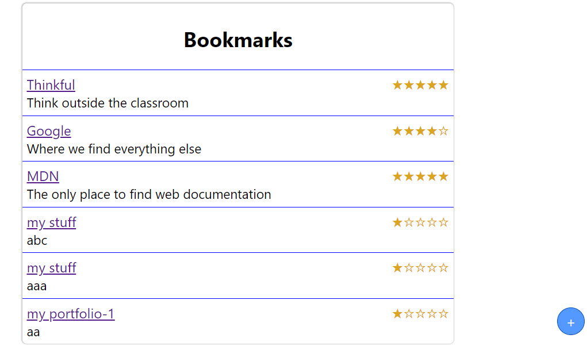
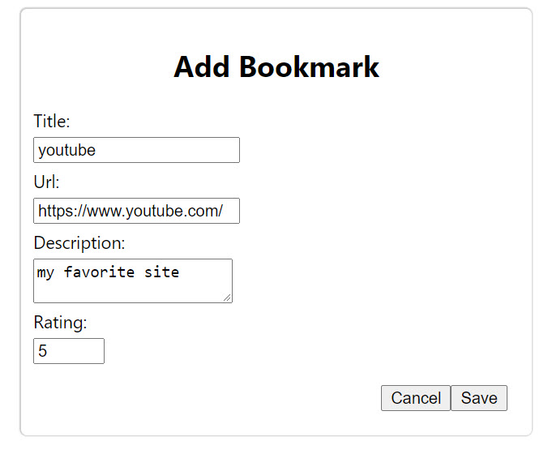
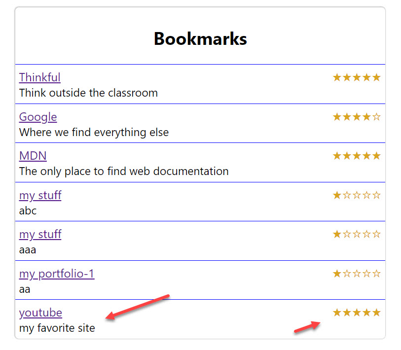

# React-Bookmark-App
This project demonstrates the use of 'React Form Control' and API fetch via Promises.

---
# APP Features
* User can add bookmark(title), an URL link, and desctipon and rating.

---
# Live Screenshots
## Main APP Screen 

## Add Bookmark(Form) Screen

## Resulting Screen

---
# Built With
* HTML
* CSS
* JavaSctipt (ES6)
* React Client - emphais on : 'React Form Control' and 'API fetch' via Promises.

---
## Demo and Code Link
- Live link : to be added
- [GitHub Code Link] (main) https://github.com/davetam88/fileuploader/tree/main

  Note: npm installation is needed to run this app.

---
## APP Type
* Project/Drill

---
## Author
* David Tam - Full Stack Developer
* Also well versed in PHP and MYSQL
